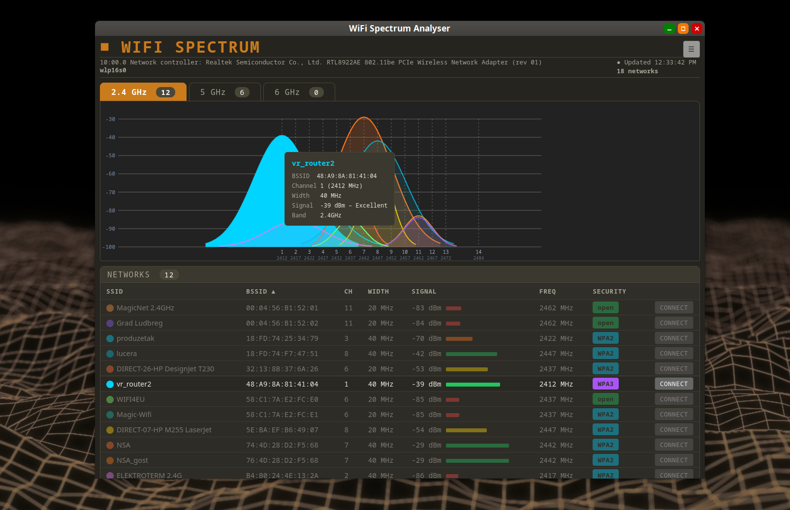
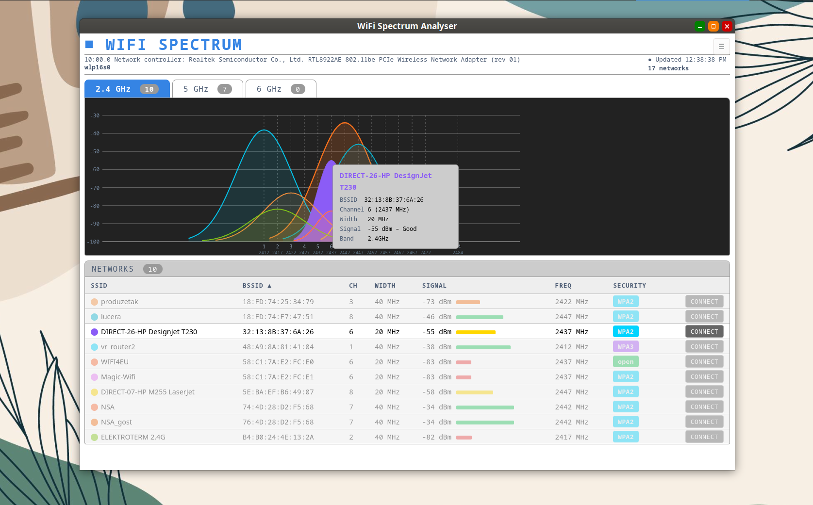
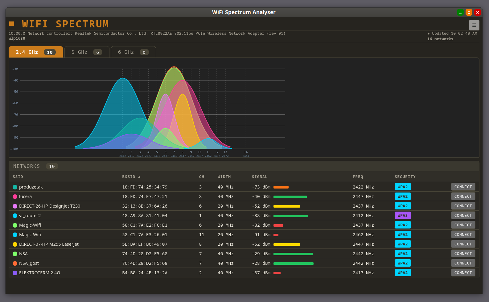
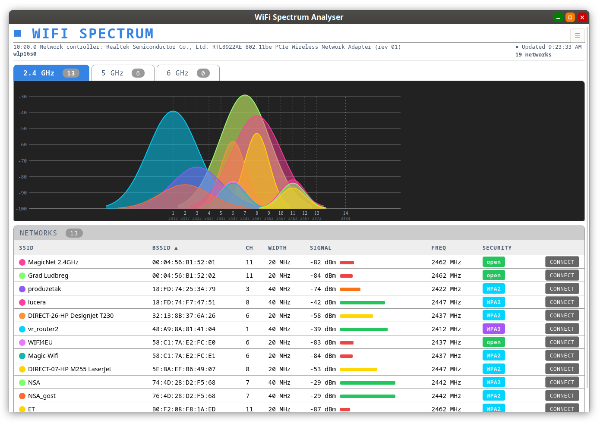

# WiFi-spectrum
WiFi Spectrum Analyser - See your WiFi spectrum, not just a list of networks.

A native Linux WiFi network scanner and spectrum visualizer, built with Python, GTK, and an embedded WebKitGTK view. Seamless on both X11 and Wayland.

## Features

- **Live spectrum visualization** — overlapping channel curves show at a glance which networks are colliding on 2.4 GHz, 5 GHz, and 6 GHz bands
- **Sortable network table** — SSID, BSSID, channel, width, signal strength, frequency, and security type
- **Hover tooltips** on both the graph and table rows, cross-highlighted by BSSID
- **One-click connect** via NetworkManager (`nmcli`)
- **rfkill awareness** — detects when WiFi is hardware/software blocked and surfaces it in the UI
- **Automatic theme detection** — follows your system theme (dark/light), or set a manual preference
- **Fully customizable appearance** — the entire UI can be restyled via theme.css

## How it works

WiFi Spectrum uses a lightweight architecture, similar in spirit to Electron but built on Python and WebKitGTK instead of Node.js and Chromium/V8:

- **GTK** handles the native window chrome and system dialogs: settings, connection prompt -the minimal native surface needed
- **WebKitGTK** renders the actual UI: spectrum graph, network table, tooltips, theming -using standard HTML/CSS/JS
- **Python** drives the backend: scanning via `nmcli`, parsing results, checking `rfkill` status, and feeding data into the view

Because WebKitGTK is Wayland-native (the same engine behind GNOME Web), the app renders identically and natively on both Wayland and X11, with no compatibility layer needed.

## Requirements

- Linux with NetworkManager (`nmcli`)
- `rfkill`
- GTK 4 and PyGObject
- WebKitGTK
- Python 3.14+ (or your distro's available Python 3 with matching bindings)

## Installation

Execute the python source OR included binary!

A prebuilt standalone binary (compiled with [Nuitka](https://nuitka.net/)) is available under [binary](binary) for systems where you'd rather not set up a Python environment. It depends on `libpython3.14`, `libm`, and `libc` — no other Python packages required at runtime.

## Configuration

Custom `nmcli` connection parameters and theme preference can be set from the settings dialog.  
[More config details...](config)

## Screenshots

| Dark mode | Light mode |
|---|---|
|  |  |
